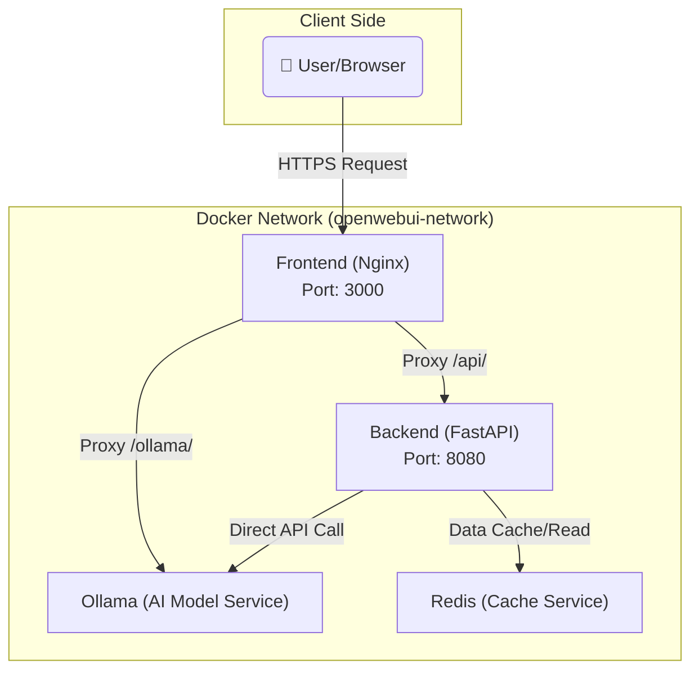

# Open WebUI Microservices Architecture Deployment

Deploy Open WebUI as a flexible and scalable microservices architecture with frontend-backend separation.

## Architecture Overview

The microservices architecture consists of four core services:

1. **Frontend Service**: Nginx-based Svelte static file service responsible for providing the user interface.
2. **Backend Service**: Python FastAPI-based core application that handles business logic and API requests.
3. **AI Model Service (Ollama)**: Responsible for running and providing large language model inference services.
4. **Cache Service (Redis)**: Provides high-performance caching and message queue support to optimize application performance.



## Quick Start

Follow these steps to quickly start and run the Open WebUI microservices.

### 1. Environment Configuration

The project manages environment variables through the `.env` file. You can start by creating your own configuration from the template file:

```bash
# Copy the microservices environment configuration file
# You can modify port settings and other configurations in the .env file as needed
cp .env.example .env
```

### 2. Start Services

Use Docker Compose to start all services with one command:

```bash
# Start all microservices in background mode
docker compose -f docker-compose.microservices.yaml up -d --build

# Check the status of all running services
docker-compose -f docker-compose.microservices.yaml ps
```

### 3. Access Services

After the services start, you can access them through the following addresses:

- **Web Interface**: `http://localhost:3000`
- **Backend API**: `http://localhost:8080`
- **API Documentation**: `http://localhost:3000/docs`
- **Ollama Service**: `http://localhost:11434` (within container network)
- **Redis Service**: `localhost:6379`

## Service Configuration

### Port Configuration

You can customize the exposed ports of services in the `.env` file:

```bash
# .env file example
FRONTEND_PORT=3000    # Frontend service port
BACKEND_PORT=8080     # Backend API port
```

### Core Environment Variables

The behavior of the backend service can be configured through environment variables:

- `OLLAMA_BASE_URL`: Address of the Ollama service, defaults to `http://ollama:11434`.
- `WEBUI_SECRET_KEY`: Key for protecting session security, recommended to set as a random long string in production environment.
- `ENABLE_SIGNUP`: Whether to allow user registration, defaults to `true`.
- `REDIS_URL`: Redis service address, used for caching and task queues.

## Network Communication

- **User → Frontend**: Users access the frontend Nginx service through browsers.
- **Frontend → Backend**: Frontend communicates with backend API through Nginx proxy (`/api/`).
- **Frontend → Ollama**: Frontend communicates with Ollama service through Nginx proxy (`/ollama/`).
- **Backend → Ollama**: Backend directly communicates with Ollama service (`http://ollama:11434`).
- **Backend → Redis**: Backend connects to Redis service for data caching.